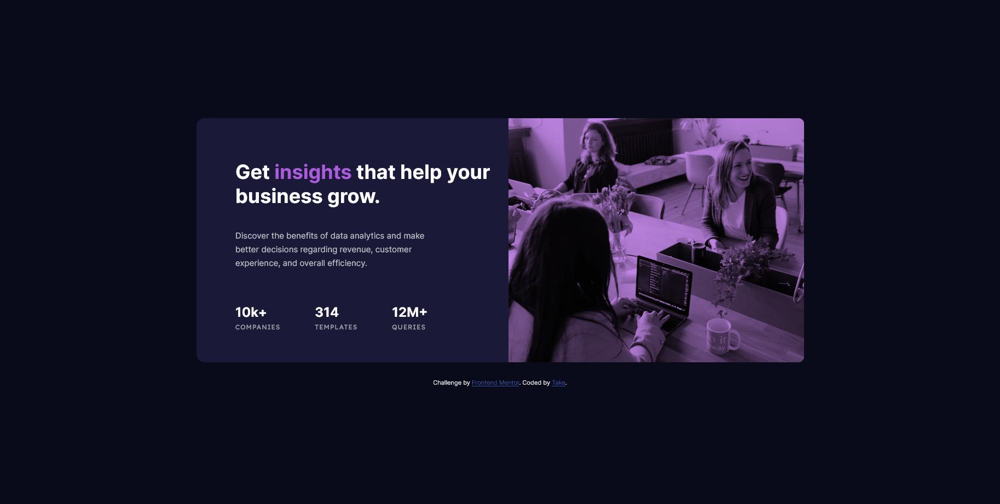

# Frontend Mentor - Stats preview card component solution

This is a solution to the [Stats preview card component challenge on Frontend Mentor](https://www.frontendmentor.io/challenges/stats-preview-card-component-8JqbgoU62). Frontend Mentor challenges help you improve your coding skills by building realistic projects.

## Table of contents

- [Overview](#overview)
  - [The challenge](#the-challenge)
  - [Screenshot](#screenshot)
  - [Links](#links)
- [My process](#my-process)
  - [Built with](#built-with)
  - [What I learned](#what-i-learned)
  - [Useful resources](#useful-resources)
- [Author](#author)

## Overview

### The challenge

Users should be able to:

- View the optimal layout depending on their device's screen size

### Screenshot



### Links

- Solution URL: [Add solution URL here](https://github.com/ttakeyaya/stats-preview-card-component/tree/master)
- Live Site URL: [Add live site URL here]

## My process

### Built with

- CSS custom properties
- Flexbox
- Mobile-first workflow

### What I learned

The mix-blend-mode CSS property was useful to blend colors without PhotoShop.

```css
&::after {
  mix-blend-mode: multiply;
}
```

### Useful resources

- [mix-blend-mode reference](https://developer.mozilla.org/en-US/docs/Web/CSS/mix-blend-mode)

## Author

- Frontend Mentor - [Take](https://www.frontendmentor.io/profile/ttakeyaya)
